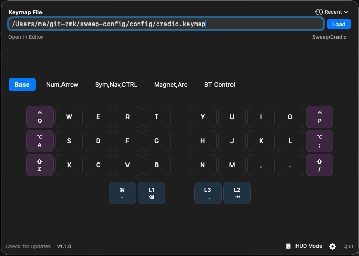

# ZMK Keymap Viewer

A lightweight macOS menu bar app that displays your ZMK keymap bindings in a visual 2D grid. Perfect for when you're learning a new layer or can't remember where you put that special key.




---

## ✨ Features

- 🎹 **Menu bar app** — Always one click away
- 🔄 **Layer switching** — Instantly switch between all your layers
- ⌨️ **Auto-detect layout** — Sweep, Corne, Sofle, Lily58, and more
- 👁️ **HUD Mode** — Transparent floating overlay (toggle with `Cmd+Shift+K`)
- 📝 **Alias support** — Add `/* =€ */` comments to show custom labels
- 🔴 **Live reload** — Watches your keymap file for changes
- 📄 **PDF Export** — Export your layout to PDF
- 🔄 **Auto-update** — Checks for updates and downloads them in-app

---

## 📥 Installation

1. Go to [**Releases**](../../releases/latest)
2. Download `ZMK-Keymap-Viewer-vX.X.X.dmg`
3. Open the DMG and drag **ZMK Keymap Viewer** to Applications
4. **First launch:** Right-click → **Open** → click **Open** (bypasses Gatekeeper)

> **Build from source:** `swift build -c release && .build/release/ZMKKeymapViewer`

---

## 🚀 Quick Start

1. Click the ⌨️ icon in your menu bar
2. Paste the path to your `.keymap` file and click **Load**
3. Click layer tabs to switch views
4. Press `Cmd+Shift+K` to toggle HUD mode

---

## 👁️ HUD Mode


- **Always-on-top** floating overlay
- **Auto-fades** after inactivity, wakes on hover
- **Resizable & draggable** — position it anywhere
- Customize opacity and timeout in Settings

---

## 📝 Alias Comments

Add custom labels to your bindings using comments:

```c
&kp LS(LA(N2)) /* =€ */     // Shows "€" instead of the binding
&kp LC(C) // =Copy          // Shows "Copy"
```

---

## 🛠️ How It Works

The app parses your `.keymap` file and extracts:
- All layers defined in the `keymap {}` block
- Bindings like `&kp`, `&lt`, `&mt`, `&trans`, `&bt`, and custom behaviors
- Layer names from comments

---

## 🤝 Contributing

Ideas and PRs welcome! Some things on the radar:

- [ ] Combos and macros visualization
- [ ] Windows/Linux support
- [ ] QMK support

---

## 📄 License

MIT © Intersebbtor

---

*Built with SwiftUI + AppKit, 100% vibe coded with GitHub Copilot* ✨
